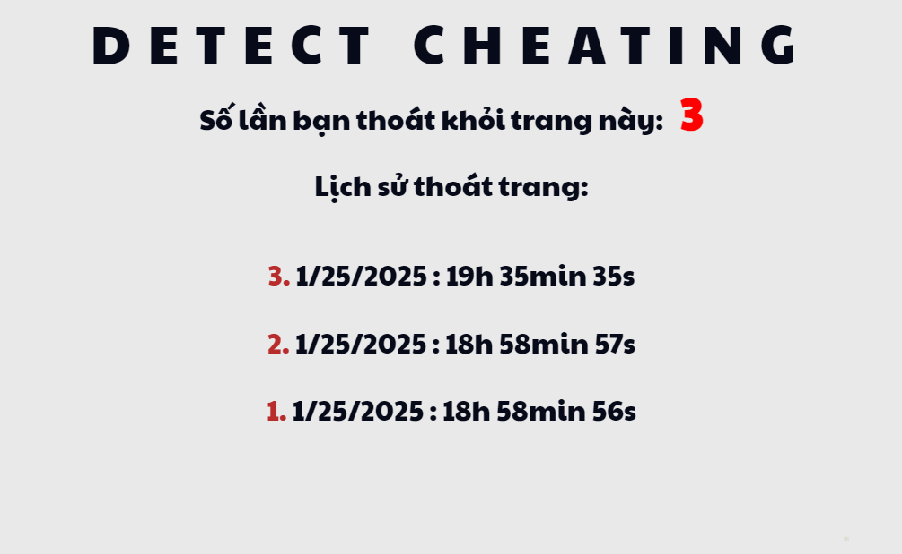

<h1 align="center">Detect Cheating Demo</h1>

<strong>A demo of "Anti Cheating" feature with simple implementation</strong>

  
  

  
  
  
  

<a href="https://yuran1811.github.io/detect-cheating/" target="_blank">Live Demo</a>

## Features

- [x] Display the number of times you're away from the site with detail info (date, time)
- [x] The page title will change whenever you are in or leave the site
- [x] The history will be stored in Local Storage unless user click "Clear History" button

## Screenshots

	

